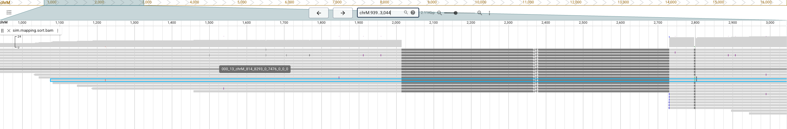
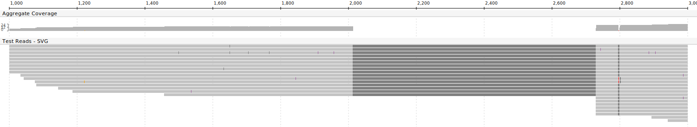
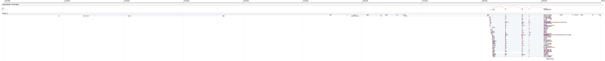

# Bamsnap-LRS

**A Static JBrowse-Style Genome Browser for Long-Read Sequencing Data**

Bamsnap-LRS is a command-line tool that generates high-quality, publication-ready visualizations of genomic alignments from BAM files. It provides a **static implementation of JBrowse-style rendering**, allowing you to create beautiful genome browser snapshots without running a web server.

## ✨ Key Features

### JBrowse-Style Visualization
- **Faithful JBrowse aesthetics**: Produces images that closely match the look and feel of JBrowse genome browser
- **Coverage track**: Displays read depth with base-level composition (variants shown in distinct colors)
- **Read pileup**: Shows individual reads with proper stacking and clipping
- **Coordinate axis**: Clear genomic position markers with gridlines

### Long-Read Support
- **Optimized for long reads**: Designed specifically for PacBio and Oxford Nanopore data
- **Large deletion handling**: Properly visualizes long deletions common in long-read alignments
- **Insertion annotations**: Shows insertion positions with length labels (e.g., `I(15)`)

### Variant Visualization
- **Mismatch detection**: Highlights mismatches using reference genome comparison
- **Color-coded bases**: A (red), C (blue), G (green), T (orange)
- **Coverage composition**: Shows variant allele frequencies in the coverage track

### Multiple Output Formats
- **SVG**: Scalable vector graphics for publications and presentations
- **PDF**: High-quality PDF output via CairoSVG
- **PNG**: Raster images for quick previews

## 📦 Installation

### Requirements
- Python 3.8+
- pysam
- Pillow
- cairosvg

### Install from source
```bash
git clone https://github.com/comery/Bamsnap-LRS.git
cd Bamsnap-LRS
pip install -r requirements.txt
chmod +x bin/bamsnap-lrs
```


## 🚀 Quick Start

### Basic Usage (DNA)
```bash
bin/bamsnap-lrs dna \
    --bam your_alignments.bam \
    --pos chr1:1000000-1001000 \
    --out snapshot.svg
```

### RNA Analysis
```bash
bin/bamsnap-lrs rna \
    --bam your_rna_alignments.bam \
    --pos chr1:1000000-1001000 \
    --out rna_snapshot.svg \
    --coverage-height 100
```

### With Reference Genome (for mismatch detection)
```bash
bin/bamsnap-lrs dna \
    --bam your_alignments.bam \
    --pos chr1:1000000-1001000 \
    --out snapshot.svg \
    --fa reference.fasta \
    --show-axis
```

### Full Example
```bash
bin/bamsnap-lrs dna \
    --bam example/sim.mapping.sort.bam \
    --pos chrM:1000-3000 \
    --out example/test_output.svg \
    --fa example/chm13v2.chrM.fasta \
    --show-axis \
    --show-coverage \
    --track-title "Long Read Alignments" \
    --width 1200
```

## 📖 Command Reference

### `dna` / `rna` - Generate genome snapshot

Both commands support similar options, with `rna` adding support for splice junction visualization.

| Option | Description | Default |
|--------|-------------|---------|
| `--bam` | BAM file path (required) | - |
| `--pos` | Genomic position (`chr:start-end` or `chr:pos`) (required) | - |
| `--out` | Output file path (`.svg`, `.pdf`, `.png`) (required) | - |
| `--fa` | Reference FASTA file path | - |
| `--width` | Image width in pixels | 1200 |
| `--read-height` | Height of each read in pixels | 6 |
| `--max-reads` | Maximum number of reads to display | 300 |
| `--mapq` | Minimum mapping quality | 0 |
| `--show-axis` | Show coordinate axis | False |
| `--show-coverage` | Show coverage track | True |
| `--no-coverage` | Hide coverage track | - |
| `--coverage-height` | Height of coverage track | 15 |
| `--track-title` | Title for the read track | "Reads" |
| `--style` | Rendering style (`default`, `jbrowse`) | jbrowse |
| `--detail` | Detail level (`low`, `mid`, `high`) | mid |
| `--show-supp` | Show supplementary alignments | False |
| `--show-secondary` | Show secondary alignments | False |
| `--show-insertion-labels` | Show insertion length labels | True |
| `--no-insertion-labels` | Hide insertion length labels | - |

## 🎨 Visual Elements

### Coverage Track
The coverage track shows read depth at each position with base composition:
- **Gray**: Reference-matching bases
- **Colored bars**: Variant bases (A=red, C=blue, G=green, T=orange)

### Read Track
Individual reads are displayed with:
- **Gray rectangles**: Matching regions
- **Colored rectangles**: Mismatches (colored by base)
- **Dark gray rectangles**: Deletions (with length annotations)
- **Purple lines**: Insertions (with `I(n)` labels)
- **Light gray regions**: Soft-clipped sequences
- **Direction arrows**: Show read orientation (solid for true ends, hollow for truncated)

### Coordinate Axis
- Genomic position labels with thousands separators
- Tick marks at regular intervals
- Vertical gridlines for easy position reference

## 📊 Output Examples

### SVG Output
```bash
python -m bamsnap_lrs dna --bam data.bam --pos chr1:1000-2000 --out result.svg
```
Best for publications, presentations, and web embedding.

### PDF Output
```bash
python -m bamsnap_lrs dna --bam data.bam --pos chr1:1000-2000 --out result.pdf
```
Requires `cairosvg` package. Ideal for print-quality documents.

### PNG Output
```bash
python -m bamsnap_lrs dna --bam data.bam --pos chr1:1000-2000 --out result.png
```
Quick raster output for previews.

### RNA Output
```bash
python -m bamsnap_lrs rna --bam data.bam --pos chr1:1000-2000 --out result.svg
```
Includes splice junction arcs.

## 🔧 Advanced Usage

### Using MD/CS Tags
If your BAM file has MD or cs tags (common with minimap2), you can use them for mismatch detection:
```bash
python -m bamsnap_lrs dna \
    --bam alignments.bam \
    --pos chr1:1000-2000 \
    --out output.svg \
    --use-cs
```

### Customizing Appearance
```bash
python -m bamsnap_lrs dna \
    --bam alignments.bam \
    --pos chr1:1000-2000 \
    --out output.svg \
    --width 1600 \
    --read-height 8 \
    --coverage-height 30 \
    --track-title "PacBio HiFi Reads"
```

## 🆚 Comparison with JBrowse

| Feature | JBrowse | Bamsnap-LRS |
|---------|---------|-------------|
| Web server required | Yes | No |
| Output format | Interactive web | Static images |
| Publication ready | Requires screenshot | Direct SVG/PDF |
| Setup complexity | High | Low |
| Visual quality | High | High (JBrowse-style) |
| Batch processing | Complex | Simple CLI |

### Visual Comparison

Below is a side-by-side comparison showing the same genomic region visualized by JBrowse and Bamsnap-LRS:

**JBrowse (Web Browser Screenshot)**



**Bamsnap-LRS (Static SVG Output)**



Both images show the same genomic region with similar visual elements:
- Coverage track with base composition
- Read pileup with direction indicators
- Coordinate axis with position markers
- Color-coded variants (mismatches, insertions, deletions)

The key difference is that Bamsnap-LRS generates this output as a static file without requiring a web server, making it ideal for publications and batch processing.

### RNA Mode Visualization

Bamsnap-LRS supports RNA-seq data visualization with splice junction arcs:



- **Pink Arcs**: Represent splice junctions (introns) or split reads
- **Arc Anchor**: Positioned at the center of the coverage track
- **Layout**: Coverage track is automatically padded to accommodate arcs

## 📁 Project Structure

```
Bamsnap-LRS/
├── src/bamsnap_lrs/
│   ├── cli.py          # Command-line interface
│   ├── reader.py       # BAM file reading
│   ├── renderer.py     # PNG rendering engine
│   ├── svg_renderer.py # SVG rendering engine
│   ├── cigar.py        # CIGAR string parsing
│   ├── pileup.py       # Coverage calculation
│   ├── layout.py       # Read stacking algorithm
│   ├── styles.py       # Color schemes
│   └── ref.py          # Reference sequence handling
├── tests/              # Unit tests
├── example/            # Example data files
└── requirements.txt    # Python dependencies
```


## 📄 License

This project is licensed under the MIT License.

## 🙏 Acknowledgments

- Inspired by [JBrowse](https://jbrowse.org/) genome browser
- Built upon the original [Bamsnap](https://github.com/parklab/bamsnap) project
- Uses [pysam](https://github.com/pysam-developers/pysam) for BAM file handling
