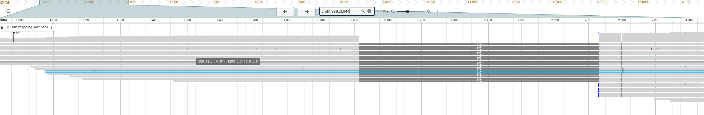
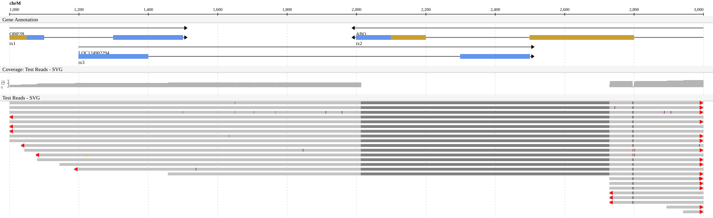
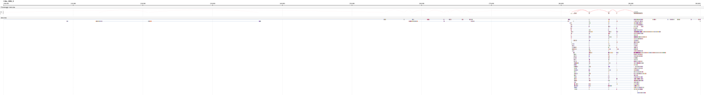
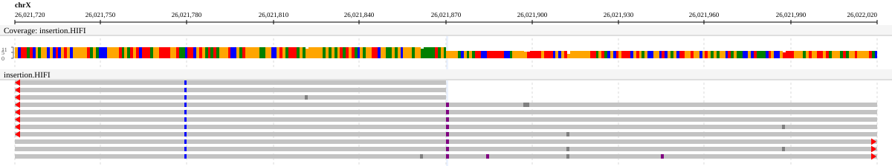
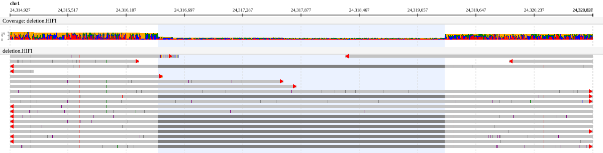
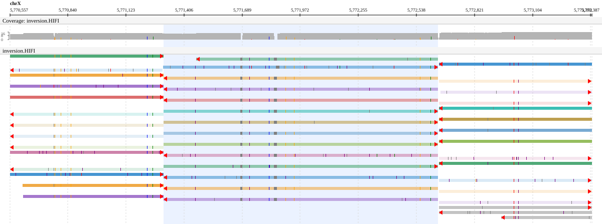
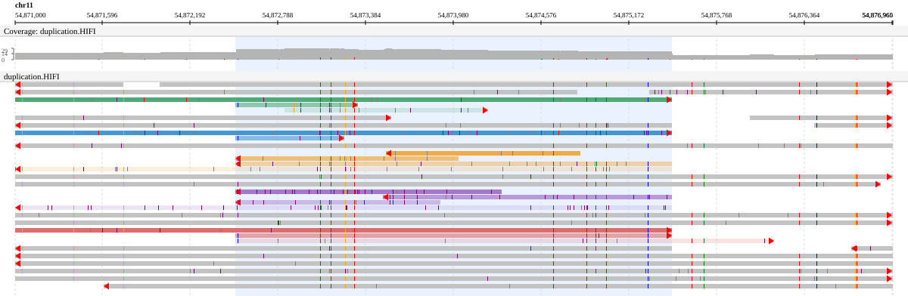
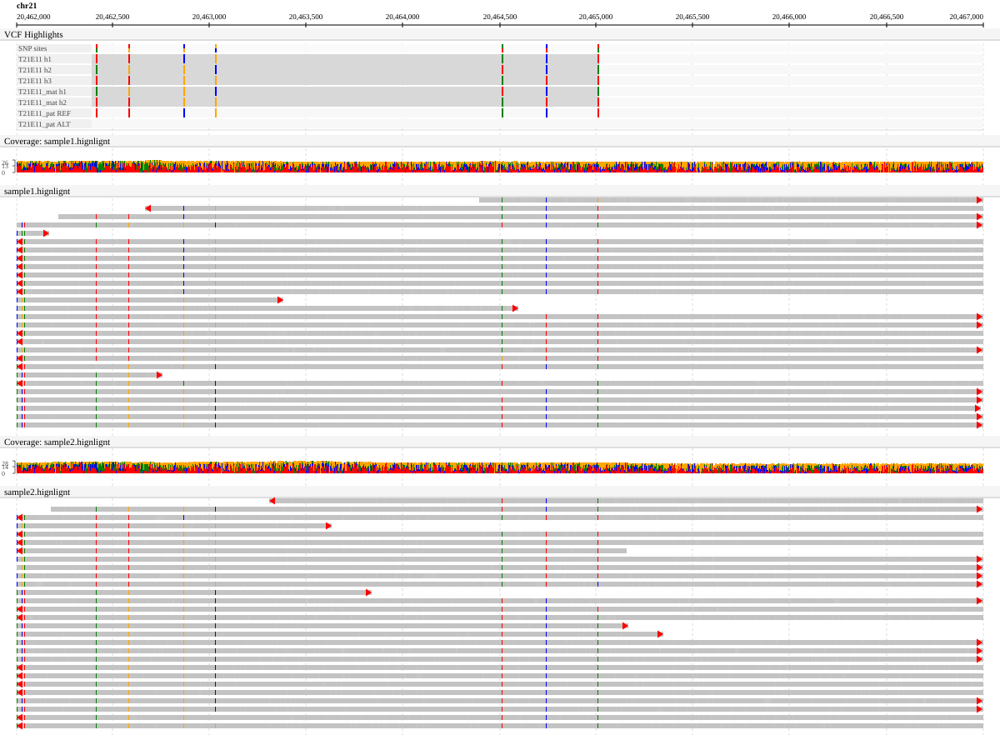

# Bamsnap-LRS

**A Static JBrowse-Style Genome Browser for Long-Read Sequencing Data**

Bamsnap-LRS is a command-line tool that generates high-quality, publication-ready visualizations of genomic alignments from BAM/CRAM files. It provides a **static implementation of JBrowse-style rendering**, allowing you to create genome browser snapshots without running a web server.

The current version adds two practical extensions for long-read variant visualization:

- **Structural variant snapshots** from BED/VCF region files, especially for insertion, deletion, duplication, and inversion events.
- **VCF highlight mode** for displaying target SNP/small-variant sites on individual reads and showing haplotype-like linkage patterns.

> Note: the current SV visualization is intended for intra-chromosomal events such as INS, DEL, DUP, and INV. Dedicated translocation / breakend cross-chromosome visualization is not currently supported.

## ✨ Key Features

### JBrowse-Style Visualization
- **Faithful JBrowse aesthetics**: Produces images that closely match the look and feel of JBrowse genome browser.
- **Coverage track**: Displays read depth with base-level composition, with variant bases shown in distinct colors.
- **Read pileup**: Shows individual reads with proper stacking, clipping, and read-orientation arrows.
- **Coordinate axis**: Clear genomic position markers with tick marks and gridlines.

### Long-Read Support
- **Optimized for long reads**: Designed for PacBio HiFi/CLR and Oxford Nanopore sequencing data.
- **Supplementary/split-read display**: Optional display of supplementary alignments for long-read SV interpretation.
- **Large deletion handling**: Properly visualizes long deletions common in long-read alignments.
- **Insertion annotations**: Shows insertion positions with length labels such as `I(15)` in non-highlight mode.
- **Multiple BAM tracks**: Supports one or more BAM/CRAM files in the same snapshot.

### Structural Variant Snapshot Support
- **VCF/BED batch input**: Use `--regions` to process multiple regions from a BED or VCF file.
- **Automatic padding**: When `--padding` is omitted, insertions and small variants use a compact window, while larger SVs use a wider window based on approximate SV length.
- **Focus region shading**: The original target interval from BED/VCF is highlighted with a pale background inside the wider padded plotting window.
- **Supported example SV types**: insertion, deletion, duplication, and inversion.
- **Current limitation**: translocation / inter-chromosomal breakend visualization is not currently supported as a dedicated display mode.

### VCF Highlight Mode
- **Dedicated `highlight` command**: A focused mode for SNP and small-variant linkage visualization.
- **VCF Highlights track**: Shows target VCF sites and per-sample REF/ALT or haplotype rows above the reads.
- **Target-site read coloring**: Only bases at VCF target positions are strongly colored on reads.
- **Reduced visual noise**: Non-target mismatches are dimmed to pale gray, insertions are hidden, and deletions are muted in highlight mode.
- **Haplotype-style sorting**: Reads are sorted by their observed base signature across highlighted VCF sites by default.
- **Read filtering**: Reads that do not overlap any highlighted VCF site are hidden by default.
- **Sample selection**: Multi-sample VCFs can be restricted with `--highlight-samples`.

### Gene and Feature Annotation
- **GFF/GTF support**: Visualize gene structures such as exons, introns, and CDS regions alongside alignments.
- **BED support**: Display BED features as an annotation track.
- **Automatic stacking**: Smart layout prevents overlapping gene or BED annotations.

### Variant Visualization
- **Mismatch detection**: Supports mismatch detection using reference FASTA comparison, MD tags, or cs tags.
- **Color-coded bases**: Variant bases are displayed using JBrowse-style colors: A=red, C=blue, G=green, T=orange, N=gray.
- **Coverage composition**: Shows reference-matching depth and variant allele composition in the coverage track.

### Multiple Output Formats
- **SVG**: Scalable vector graphics for publications, presentations, and post-editing.
- **PDF**: High-quality PDF output via CairoSVG.
- **PNG**: Raster output for quick preview and sharing.

## 📦 Installation

### Requirements
- Python 3.8+
- pysam
- Pillow
- cairosvg

### Install from source
```bash
git clone https://github.com/comery/Bamsnap-LRS.git
cd Bamsnap-LRS
pip install -r requirements.txt
chmod +x bin/bamsnap-lrs
```

## 🚀 Quick Start

### Basic Usage (DNA)
```bash
python bin/bamsnap-lrs dna \
    --bam your_alignments.bam \
    --pos chr1:1000000-1001000 \
    --out snapshot.svg
```

### RNA Analysis
```bash
python bin/bamsnap-lrs rna \
    --bam your_rna_alignments.bam \
    --pos chr1:1000000-1001000 \
    --out rna_snapshot.svg \
    --coverage-height 100
```

### With Reference Genome (for mismatch detection)
```bash
python bin/bamsnap-lrs dna \
    --bam your_alignments.bam \
    --pos chr1:1000000-1001000 \
    --out snapshot.svg \
    --fa reference.fasta \
    --show-axis
```

### Batch Region Plotting from BED/VCF
```bash
python bin/bamsnap-lrs dna \
    --bam your_alignments.bam \
    --regions example/test_regions.vcf \
    --out-prefix example/batch.svg \
    --fa example/chm13v2.chrM.fasta \
    --show-axis \
    --show-coverage
```

When `--regions` is used, `--out-prefix` is required. Output files are named using the prefix and each parsed genomic interval, for example:`batch_chrM_0_3000.svg` 

### Structural Variant Snapshot Example
```bash
python bin/bamsnap-lrs dna \
    --bam example/SV_show/insertion.HIFI.bam \
    --bam example/SV_show/insertion.ONT.bam \
    --bam example/SV_show/insertion.Cyclone.bam \
    --regions example/SV_show/insertion.vcf \
    --out-prefix example/SV_show/insertion.svg \
    --show-axis \
    --show-coverage \
    --show-supp
```

For SV visualization, `--show-supp` is recommended because supplementary/split alignments often provide the most direct evidence for duplications and inversions.

### VCF Highlight Example
```bash
python bin/bamsnap-lrs highlight \
    --bam example/highlight/sample1.hignlignt.bam \
    --bam example/highlight/sample2.hignlignt.bam \
    --pos chrom:start-end \
    --highlight-vcf example/highlight/region_chr21.vcf.gz \
    --out example/highlight/highlight.svg \
    --show-coverage
```

## 📖 Command Reference

### `dna` / `rna` - Generate genome snapshot

Both commands support similar options, with `rna` adding support for splice junction visualization.

| Option | Description | Default |
|--------|-------------|---------|
| `--bam` | BAM/CRAM file path(s). Multiple files are supported. | required |
| `--pos` | Single genomic position, `chr:start-end` or `chr:pos`. Mutually exclusive with `--regions`. | - |
| `--regions` | BED or VCF file for batch plotting. VCF records support SV-style intervals. Mutually exclusive with `--pos`. | - |
| `--out` | Output file path for single-region mode (`.svg`, `.pdf`, `.png`). | required with `--pos` |
| `--out-prefix` | Output prefix for batch mode. Output files are named by prefix plus genomic interval. | required with `--regions` |
| `--padding` | Manually set padding on both sides of each BED/VCF region. If omitted, padding is inferred automatically. | auto |
| `--fa` | Reference FASTA file path. Required for reliable reference-based mismatch detection and often needed for CRAM. | - |
| `--width` | Image width in pixels. | 1200 |
| `--read-height` | Height of each read in pixels. | 6 |
| `--max-reads` | Maximum number of reads to display. | 300 |
| `--mapq` | Minimum mapping quality. | 0 |
| `--show-axis` | Show coordinate axis. | False for DNA/RNA; True for highlight |
| `--show-coverage` | Show coverage track. | True |
| `--no-coverage` | Hide coverage track. | - |
| `--coverage-height` | Height of coverage track. | 15 |
| `--coverage-max-depth` | Maximum displayed coverage depth. | auto |
| `--track-title` | Title(s) for read tracks. Multiple titles can be supplied for multiple BAM files. | BAM basename |
| `--gff` | GFF/GTF file path for gene annotation. Mutually exclusive with `--bed`. | - |
| `--bed` | BED file path for feature annotation. Mutually exclusive with `--gff`. | - |
| `--style` | Rendering style: `default` or `jbrowse`. | `jbrowse` |
| `--detail` | Detail level: `low`, `mid`, or `high`. | `mid` |
| `--downsample-strategy` | Downsampling strategy: `mapq` or `first`. | `mapq` |
| `--color-by` | Read coloring method: `type`, `base`, `strand`, or `mapq`. | `type` |
| `--use-md` | Use MD tag to detect mismatches. | False |
| `--use-cs` | Use cs tag to detect mismatches. | False |
| `--show-supp` | Show supplementary alignments. Recommended for SV snapshots. | False |
| `--show-secondary` | Show secondary alignments. | False |
| `--show-insertion-labels` | Show insertion length labels. | True |
| `--no-insertion-labels` | Hide insertion length labels. | - |
| `--show-composition` | Show base composition chart. | False |
| `--comp-height` | Base composition chart height. | auto |
| `--comp-max-depth` | Maximum depth for base composition chart. | auto |

### `highlight` - Highlight VCF target sites on reads

The `highlight` command reuses the DNA/RNA rendering pipeline but requires a VCF file containing the target sites.

| Option | Description | Default |
|--------|-------------|---------|
| `--highlight-vcf` | VCF/VCF.GZ file containing SNP or small-variant sites to highlight. | required |
| `--highlight-samples` | Sample names from the VCF header to display. If omitted, all samples are shown. | all samples |
| `--mode` | Sequencing mode: `dna` or `rna`. | `dna` |
| `--no-hap-sort` | Disable read sorting by observed haplotype signature. | hap-sort on |
| `--no-hap-filter` | Keep reads that do not overlap any highlighted VCF site. | hap-filter on |

All common options from `dna`/`rna` are also available in `highlight` mode, including `--bam`, `--pos`, `--regions`, `--out`, `--out-prefix`, `--fa`, `--show-coverage`, `--gff`, and `--bed`.

## 🎨 Visual Elements

### Coverage Track
The coverage track shows read depth at each position with base composition:

- **Gray**: reference-matching bases
- **Colored bars**: variant bases
  - **A** = red
  - **C** = blue
  - **G** = green
  - **T** = orange
  - **N** = gray

### Read Track
Individual reads are displayed with:

- **Gray rectangles**: matching regions
- **Colored rectangles**: mismatches, colored by the observed read base
- **Dark gray rectangles**: deletions, with length annotations in high-detail mode
- **Purple blocks/lines**: insertions, with labels such as `I(n)` in non-highlight mode
- **Pale blue regions**: soft-clipped or hard-clipped sequence segments
- **Direction arrows**: read orientation; arrows indicate whether the read is aligned to the forward or reverse strand

### Supplementary / Split-Read Coloring
When `--show-supp` is enabled, Bamsnap-LRS can display multiple visible alignment pieces from the same read name. This is useful for long-read SV interpretation.

- A read with multiple visible alignment pieces is treated as a split-read group.
- Pieces from the same read name share the same color.
- Opacity changes according to the piece order on the original read.
- Single visible supplementary alignments are rendered like ordinary reads if no other piece from the same read is visible in the current window.

This display is especially useful for INS, DEL, DUP, and INV examples. It is not intended as a complete translocation / inter-chromosomal breakend viewer.

### Structural Variant Focus Region
For BED/VCF batch plotting, the target interval is drawn as a pale background region inside the full padded plotting window. This helps distinguish the actual variant interval from the flanking context.

For VCF input:

- insertion-like records use a compact window.
- Larger DEL/DUP/INV/CNV-like records use a window based on the approximate SV length.
- If `--padding` is supplied, the user-provided value overrides automatic padding.

### VCF Highlights Track
In `highlight` mode, a dedicated **VCF Highlights** track is drawn above the reads.

- The top SNP marker row shows target VCF positions.
- Each sample gets REF/ALT rows or haplotype rows depending on genotype phasing information.
- Phased sites with `GT` using `|` and a `PS` tag are displayed as haplotype rows.
- REF/ALT bases use the same base colors as read mismatches.
- Gray background blocks can indicate phase-set spans.

### Read Coloring in Highlight Mode
Highlight mode changes the read display to make target-site linkage easier to see:

- Bases at VCF target sites are colored by the observed read base.
- Non-VCF mismatches are dimmed to pale gray.
- Insertions are suppressed to reduce visual noise.
- Deletions are drawn in muted gray.
- Reads that do not overlap any highlighted VCF site are hidden by default.
- Reads are sorted by their observed base signature across target sites by default.

### Coordinate Axis
- Genomic position labels with thousands separators
- Tick marks at regular intervals
- Vertical gridlines for easy position reference

### Gene Annotation Track
- **Cornflower blue**: UTR / non-coding regions
- **Brownish yellow**: CDS / coding regions
- **Thin black line**: introns, with strand direction arrows
- **Automatic stacking**: multiple overlapping genes are shown on separate levels

### BED Annotation Track
BED features can be displayed with `--bed`. BED3 through BED12-style records are supported, including optional feature names, strand information, item RGB colors, and block structures when available.

## 🔧 Advanced Usage

### Using MD/CS Tags
If your BAM file has MD or cs tags, such as minimap2-style `cs` tags, you can use them for mismatch detection:

```bash
bin/bamsnap-lrs dna \
    --bam alignments.bam \
    --pos chr1:1000-2000 \
    --out output.svg \
    --use-cs
```

### Using a Reference FASTA
Reference-based mismatch detection can be enabled by providing `--fa`:

```bash
bin/bamsnap-lrs dna \
    --bam alignments.bam \
    --pos chr1:1000-2000 \
    --out output.svg \
    --fa reference.fasta
```

### Customizing Appearance
```bash
bin/bamsnap-lrs dna \
    --bam alignments.bam \
    --pos chr1:1000-2000 \
    --out output.svg \
    --width 1600 \
    --read-height 8 \
    --coverage-height 30 \
    --track-title "PacBio HiFi Reads"
```

### Manual SV Padding
Automatic padding is used by default for BED/VCF records. You can override it with `--padding`:

```bash
bin/bamsnap-lrs dna \
    --bam example/SV_show/deletion.HIFI.bam \
    --regions example/SV_show/deletion.vcf \
    --out-prefix example/SV_show/deletion.manual_padding.svg \
    --show-supp \
    --padding 1000
```

### Keeping All Reads in Highlight Mode
By default, highlight mode hides reads that do not overlap any highlighted VCF site. To keep all reads:

```bash
bin/bamsnap-lrs highlight \
    --bam alignments.bam \
    --pos chr21:start-end \
    --highlight-vcf target_sites.vcf.gz \
    --out highlight.all_reads.svg \
    --no-hap-filter
```

### Disabling Haplotype Sorting in Highlight Mode
```bash
bin/bamsnap-lrs highlight \
    --bam alignments.bam \
    --pos chr21:start-end \
    --highlight-vcf target_sites.vcf.gz \
    --out highlight.no_sort.svg \
    --no-hap-sort
```

## 🆚 Comparison with JBrowse

| Feature | JBrowse | Bamsnap-LRS |
|---------|---------|-------------|
| Web server required | Yes | No |
| Output format | Interactive web | Static SVG/PDF/PNG images |
| Publication ready | Requires screenshot | Direct SVG/PDF output |
| Setup complexity | High | Low |
| Visual quality | High | High (JBrowse-style) |
| Batch processing | Complex | Simple CLI with `--regions` |
| Long-read SV snapshots | Interactive inspection | Static split-read snapshots |
| VCF target-site highlighting | Interactive tracks | Static VCF highlight snapshots |

### Visual Comparison

Below is a side-by-side comparison showing the same genomic region visualized by JBrowse and Bamsnap-LRS:

**JBrowse (Web Browser Screenshot)**



**Bamsnap-LRS (Static SVG Output)**



Both images show the same genomic region with similar visual elements:

- Coverage track with base composition
- Read pileup with direction indicators
- Coordinate axis with position markers
- Color-coded variants, including mismatches, insertions, and deletions

The key difference is that Bamsnap-LRS generates this output as a static file without requiring a web server, making it suitable for publications, presentations, and batch processing.

### RNA Mode Visualization

Bamsnap-LRS supports RNA-seq data visualization with splice junction arcs:



- **Pink arcs**: splice junctions, introns, or split reads
- **Arc anchor**: positioned at the center of the coverage track
- **Layout**: coverage track is automatically padded to accommodate arcs

### Structural Variant Visualization

Example SV snapshots are available in `example/SV_show/`:

**insertion**


**deletion**


**inversion**


**duplication**


These examples demonstrate how long-read split alignments and supplementary alignments can help inspect intra-chromosomal structural variants. Translocation / inter-chromosomal breakend visualization is not currently supported as a dedicated mode.

### Highlight Mode Visualization

The highlight example is available in `example/highlight/`:



This mode is designed to show how reads span multiple VCF target sites and to make allele-linkage patterns easier to inspect in a static figure.


## 📄 License

This project is licensed under the MIT License.

## 🙏 Acknowledgments

- Inspired by [JBrowse](https://jbrowse.org/) genome browser
- Built upon the original [Bamsnap](https://github.com/parklab/bamsnap) project
- Uses [pysam](https://github.com/pysam-developers/pysam) for BAM/CRAM file handling
